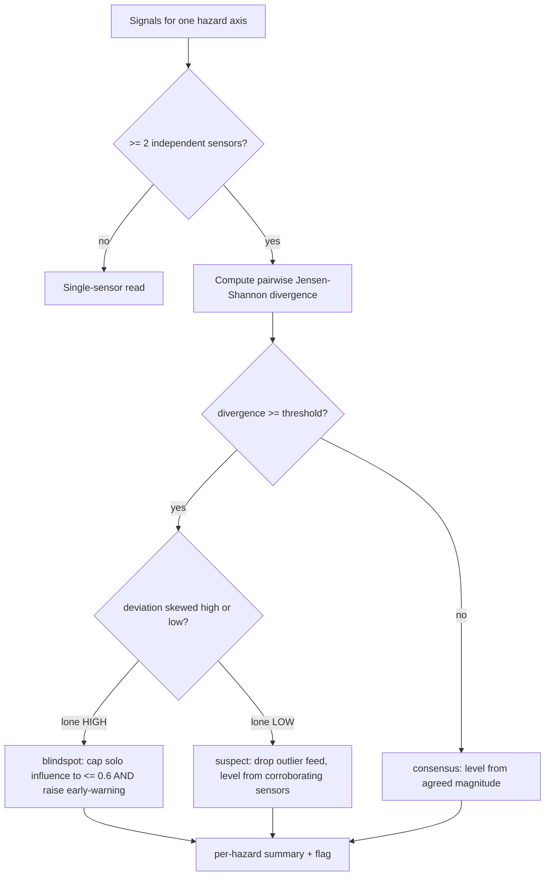
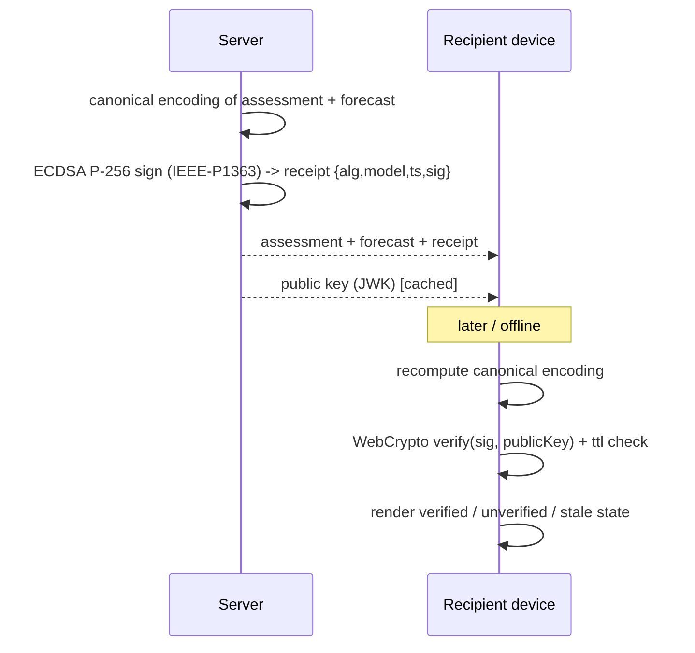
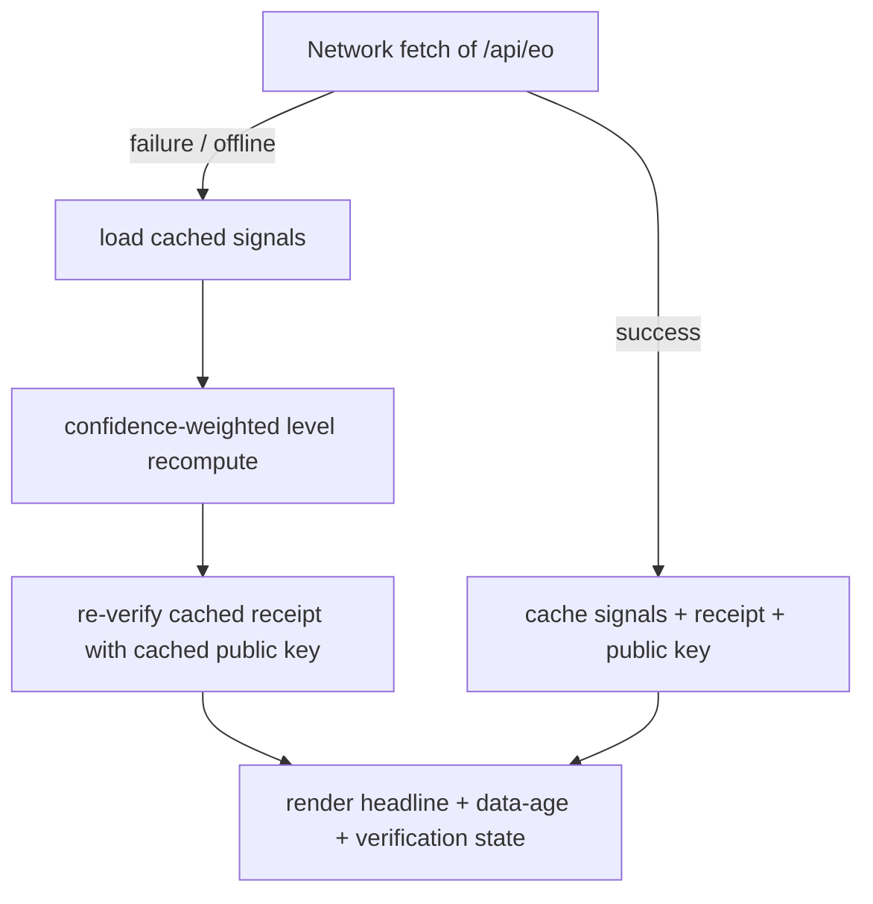
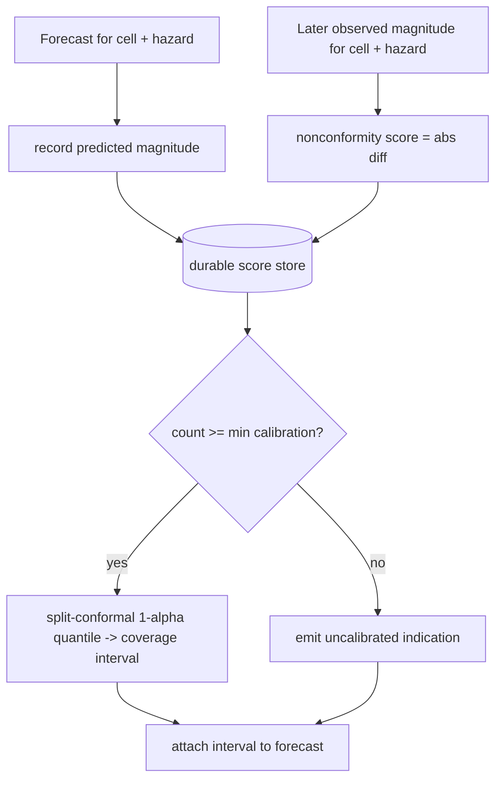
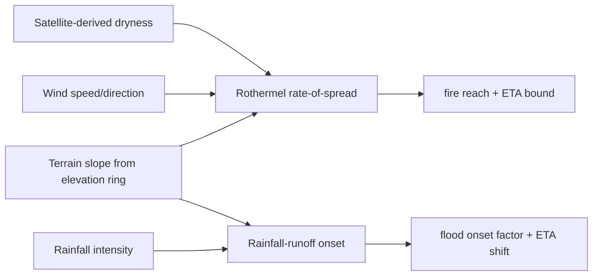

# Patent Drawings (renderable Mermaid; convert to formal figures for filing)

These correspond to the "Brief Description of the Drawings" in the specification. Each
renders on GitHub. FIG. 3 syntax validated via Mermaid; all follow the same grammar.

## FIG. 1 — System architecture

```mermaid
flowchart LR
  subgraph Sources[Heterogeneous EO sources]
    F[FIRMS multi-satellite fire]
    A[CAMS / Sentinel-5P aerosol-NO2-SO2-CO]
    S[Sentinel-1 SAR / Sentinel-2 / Sentinel-3]
    W[Open-Meteo / GloFAS / NASA POWER]
    U[USGS seismic]
  end
  Sources --> AD[Adapter layer: query lat,lng -> Signal]
  AD --> FU[Fusion engine + divergence gating]
  FU --> PR[Prediction engine: physics-bound + conformal]
  FU --> PV[Provenance signer ECDSA P-256]
  PR --> PV
  PV --> API[/api/eo response + receipt/]
  PV --> PK[/api/eo/pubkey public key/]
  API --> DEV[Recipient device]
  PK --> DEV
  DEV --> OFF[On-device recompute + offline WebCrypto verify]
```

## FIG. 3 — Divergence-gating (validated)

## FIG. 4 — Offline-verifiable provenance (sequence)

## FIG. 5 — On-device offline recomputation

## FIG. 6 — Conformal calibration loop

## FIG. 7 — Physics-constrained propagation

